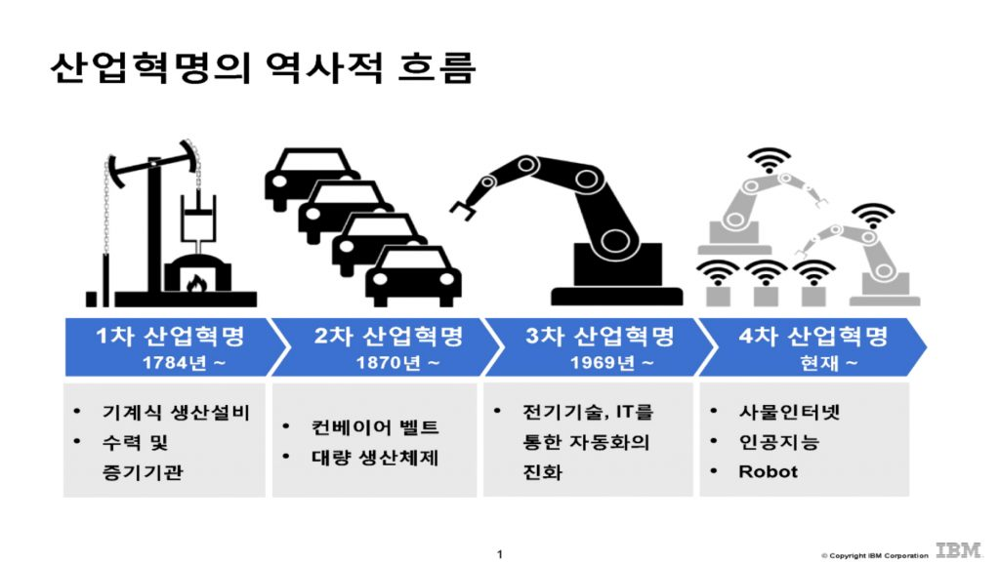

# 4차 산업혁명의 도래
## 4차 산업혁명의 개념
> 4차 산업혁명은 2016년 다보스포럼에서 클라우스 슈밥이 처음 제시한 개념이다. 아직까지 충분한 논의가 이루어지지 않아 그 의미가 명확히 정립된 것은 아니다. 4차 산업혁명을 정의하기란 쉽지 않지만, 최근의 논의를 종합해보면 '3차 산업력명을 기반으로 하여 디지털, 생물학, 물리학 등의 경계가 업어지고 융합되는 기술혁명', 또는 '인터넷을 통해 모아진 인간의 행위와 생각을 온라인상의 거대한 데이터 저장고에 넣어 활용하는 일련의 경제적 활동'으로 정의할 수 있다.

## 4차 산업혁명의 특징
>사물인터넷과 클라우드, 빅데이터 등은 4차 산업혁명을 상징하는 단어이다. 특히 4차 산업혁명은 속도, 범위, 영향력 등의 측면에서 3차 산업혁명과 차별화되고, 인류가 한 번도 경험하지 못한 새로운 시대를 접하게 될 것이라고 강조되고 있다. 즉 획기적인 기술 진보, 파괴적 기술에 의한 산업 재편, 전반적인 시스템의 변화 등이 4차 산업혁명의 주요 특징이라 할 수 있다. 이러한 4차 산업혁명은 기술 융합으로 생산성을 높이고 생산 및 유통비용을 낮춰 개인의 소득 증가와 삶의 질 향상이라는 긍정적 효과를 기대할 수 있다. 하지만 사회적 불평등, 빈부 격차뿐만 아니라 기계가 사람을 대체하면서 우려되는 노동시장의 붕괴와 같은 부정적인 요소도 무시할 수 없다. 특히 향후 노동시장은 '고기술/고임금'과 '저기술/저임금'간의 격차가 벌어지고 일자리 양분으로 중산층의 지위가 축소될 가능성이 크다.

| 구분 | 설명 |
|:---:|:---|
| 1차 산업혁명 | * 18세기에 영국에서 증기기관의 발명과 기계식 생산 방식이 도입되면서 시작  * 농업과 수공업 경제에서 기계를 사용하는 제조업 경제로 전환 |
| 2차 산업혁명 | * 19세기에 컨베이어 벨트가 도입되고 분업과 자동화 생산이 확산되면서 시작  * 자동차 등 제조업 제품을 공급자 중심으로 대량생산 |
| 3차 산업혁명 | * 1970년대부터 자동화 대량생산 체계가 도입되면서 시작되어 현재까지 지속  * 제조업의 디지털화와 자동화 시작 |
| 4차 산업혁명 | * 기계와 사람, 인터넷 서비스가 상호 연결되어 가볍고 유연한 생산 체계 구현  * 대량 맞춤 생산이 가능한 생산 패러다임으로의  |

| `PLUS NOTE` 3차 산업혁명과 4차 산업혁명의 차이 |
|:---|
|3차 산업혁명에서 인간의 주요한 역할이 자동화를 위한 프로그래밍이었다면, 4차 산업혁명에서는 컴퓨터와 기계가 소통하는 생태계를 어떻게 활용하고 의미 있는 가치를 창출해낼 것인지가 인간의 주요한 역할이 될 것이다. 또한 3차 산업혁명에서 인간이 컴퓨터와 기계를 밀접하게 연계하여 생산의 자동화를 이루어냈다면, 4차 산업혁명에서는 컴퓨터와 기계가 인공지능에 의해 독자적으로 상호 소통하는 스마트화가 이루어질 것이다.|
|  |
## 4차 산업혁명 시대의 도시

## 
